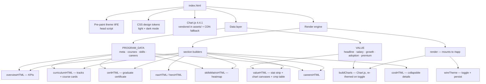

# Architecture — MS Applied AI Dashboard

## Recent evolution (v2)

- **Brand:** orange Amberton palette (light + dark variants) replaces the original purple accent.
- **Voice:** first-person personal-journey framing across supporting copy ("My journey", "I've chosen"); big headings and KPI numbers kept stable.
- **Sections:** added **Cost**; reordered to Overview → Curriculum → Skills → Why It Matters (Value) → Careers → Cost.
- **Courses:** each required/core course now carries a `competencies[]` array + official `url`, surfaced via an expandable card and linked from the skills heatmap (code + every cell).
- **Hero:** university seal (links to amberton.edu) with "Garland, TX" caption; tightened vertical spacing throughout.
- **Value charts:** reframed to organizational impact (readiness, impact, functions, adoption); illustrative badges removed.

## Overview

A single self-contained `index.html` with no build step. All markup, styling, and logic live in one file. Data is fully decoupled from rendering: two plain-object data sources feed a small render engine that builds the DOM as HTML strings.

## Data flow

1. **Pre-paint theme script** (in `<head>`) reads `localStorage` / OS preference and sets `data-theme` before first paint to avoid a flash.
2. **`PROGRAM_DATA`** and **`VALUE`** are declared as the single sources of truth.
3. **`render()`** concatenates section-builder output into `#app.innerHTML`, then injects the nav at `body` top.
4. **`buildCharts()`** reads CSS custom properties at runtime so charts match the active theme; it destroys and rebuilds chart instances on theme toggle.

## Key design decisions

| Decision | Why |
|---|---|
| Data/render separation | Real syllabi and cited stats drop into `PROGRAM_DATA` / `VALUE` with no markup edits. |
| HTML-string rendering (no framework) | Keeps it a true single file with zero build/deps beyond Chart.js. |
| `Illustrative` badge + `illus` flag | Enforces data integrity — unverified figures are visually and structurally marked. |
| Skill ids shared across courses + matrix | One taxonomy (`PROGRAM_DATA.skills`) powers both course tags and the heatmap. |
| Charts read CSS vars at runtime | Single source of color truth; correct rendering in both themes. |

## Sections → data mapping

| Section | Source | Notes |
|---|---|---|
| Overview KPIs | `PROGRAM_DATA.meta` + `.courses` | Course count derived; **Completed & In Progress** KPI sums credits by `status` ÷ total. |
| Curriculum | `PROGRAM_DATA.courses` + `.groups` | Grouped by `group`, ordered required → core → elective; status badges + `term` labels. |
| Graduate Certificate | `PROGRAM_DATA.certificate` | Required courses resolved against `courses` for live titles/status. |
| Why It Pays | `VALUE` | 4 Chart.js canvases + headline strip + comparison table. |
| Skills Matrix | `PROGRAM_DATA.courses` × `.skills` | Heat level: primary skill = darkest, secondary = mid; per-course status pill. |
| Careers | `PROGRAM_DATA.careers` | Static role cards. |
| Cost | `PROGRAM_DATA.meta.costPerCredit` | Collapsed by default in a native `
` disclosure. |

## Verification

- Bracket/brace/paren balance check (`grep -o` counts must match).
- `\!` escape audit (Python-injection pitfall) — must return none.
- Served via `python3 -m http.server` and driven in a real browser (Flow preview pane does not execute JS).
- Screenshot review of all sections + chart rendering.

## Dependencies

- **Chart.js 4.4.1** — vendored locally at `assets/chart.umd.min.js` and loaded same-origin so it survives external-CDN blocking on restrictive hosting networks. A jsDelivr `<script>` is retained only as an `onerror` fallback.
- No other runtime dependencies.
