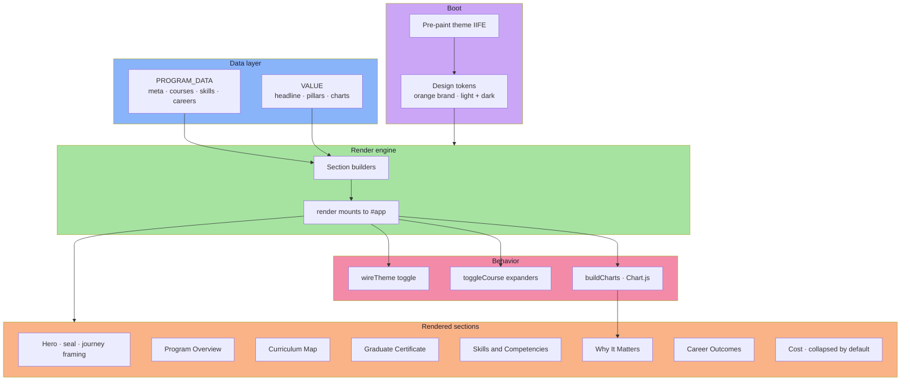
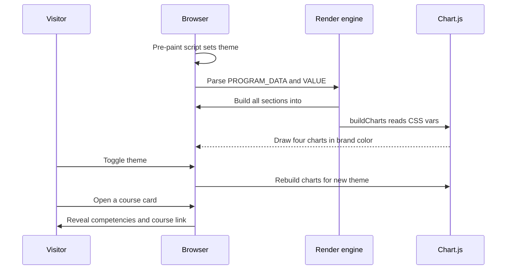

<div align="center">

```
███╗   ███╗███████╗     █████╗ ██████╗ ██████╗ ██╗     ██╗███████╗██████╗      █████╗ ██╗
████╗ ████║██╔════╝    ██╔══██╗██╔══██╗██╔══██╗██║     ██║██╔════╝██╔══██╗    ██╔══██╗██║
██╔████╔██║███████╗    ███████║██████╔╝██████╔╝██║     ██║█████╗  ██║  ██║    ███████║██║
██║╚██╔╝██║╚════██║    ██╔══██║██╔═══╝ ██╔═══╝ ██║     ██║██╔══╝  ██║  ██║    ██╔══██║██║
██║ ╚═╝ ██║███████║    ██║  ██║██║     ██║     ███████╗██║███████╗██████╔╝    ██║  ██║██║
╚═╝     ╚═╝╚══════╝    ╚═╝  ╚═╝╚═╝     ╚═╝     ╚══════╝╚═╝╚══════╝╚═════╝     ╚═╝  ╚═╝╚═╝
```

**A personal-journey dashboard for Amberton University's MS in Applied Artificial Intelligence**

   

🔗 **[View the live dashboard ↗](https://sjg-2026.github.io/ms-in-artificial-intelligence/)**

</div>

---

An interactive, single-file dashboard that reframes Amberton University's **MS in Applied Artificial Intelligence** as a deliberate personal journey — honoring the time, energy, and commitment a learner chooses to invest, and the genuine value that dedication brings back to their team and organization.

> **Source data:** [Amberton MS Applied AI program page ↗](https://amberton.edu/degree-programs/master-of-science-applied-artificial-intelligence) and the official per-course catalog pages.

## Architecture

The entire dashboard is one `index.html` with no build step. Data is fully decoupled from rendering: two plain-object sources (`PROGRAM_DATA` and `VALUE`) feed a small render engine that builds the DOM as HTML strings, then Chart.js draws the visualizations. A pre-paint script sets the theme before first paint; the render engine wires the theme toggle, course expanders, and charts after mounting. See the [diagrams](#diagrams) at the end for the full picture.

## Sections

| Section | Source | Notes |
|---|---|---|
| Hero | `PROGRAM_DATA.meta` / `.mission` | Full-width title banner, smaller seal below (links to amberton.edu), "Garland, TX", journey CTAs |
| Program Overview | `PROGRAM_DATA.meta` / `.audience` / `.outcomes` | KPI cards incl. a **Completed & In Progress** progress metric (with credit breakdown), computed live from course status |
| Curriculum Map | `PROGRAM_DATA.courses` / `.groups` | Color-coded tracks, expandable competencies, per-course links, **status badges** (completed / in progress) and custom **term labels** |
| Graduate Certificate | `PROGRAM_DATA.certificate` | Stackable Applied AI certificate; required courses pulled live from `courses` with their current status |
| Skills & Competencies | `PROGRAM_DATA.courses` × `.skills` | Heatmap of all courses with per-course status pills; every cell + course code links to its Amberton page |
| Why It Matters | `VALUE` | Cited headline stats, five value pillars, four Chart.js charts, comparison table |
| Career Outcomes | `PROGRAM_DATA.careers` | Roles the journey unlocks |
| Cost | `PROGRAM_DATA.meta.costPerCredit` | $325/credit, < $1,000 per class, est. total tuition — **collapsed by default** behind a `<details>` toggle |

## Course status

Each course in `PROGRAM_DATA.courses` may carry optional status fields that drive badges, the curriculum/skills/certificate displays, and the progress KPI:

| Field | Values | Effect |
|---|---|---|
| `status` | `"completed"` / `"inProgress"` / *(omit)* | Green or amber badge; counts toward the Completed & In Progress KPI |
| `completedVia` | e.g. `"Transfer credit"` | Appended to the completed badge |
| `term` | e.g. `"Transferred"`, `"Summer 2026"`, `"2027"` | Replaces the default "term N" badge |

## Updating the data

Everything flows from two objects at the top of the `<script>` block:

| Object | Holds | Swap in… |
|---|---|---|
| `PROGRAM_DATA` | meta, mission, audience, outcomes, **courses** (+ competencies + URLs), skills taxonomy, careers | Real syllabi, refined skill mappings |
| `VALUE` | headline stats, pillars, chart data (readiness, impact, functions, adoption) | Verified, cited market figures |

To add a course, append to `PROGRAM_DATA.courses` with `code`, `title`, `group` (`required`/`core`/`elective`), `credits`, `seq` (1–4), a `skills` array, a `url`, and a `competencies` array — plus optional `status` / `completedVia` / `term` fields (see [Course status](#course-status)). The curriculum, skills heatmap, certificate, KPIs, and expanders all update automatically. The Graduate Certificate is defined separately in `PROGRAM_DATA.certificate` (overview text, required course codes, note, source URL).

## Voice & framing

Copy is written in the **first person** ("My journey", "I've chosen", "the strengths I'll carry forward") to make the dashboard read as the learner's own commitment. The big section headings and KPI numbers are kept stable; supporting copy carries the journey/dedication tone. Competency lists are sourced verbatim (or as faithful close paraphrases where source quote limits applied) from the official Amberton course pages.

## Quick Start

```bash
# JavaScript does not run in preview panes — use a real browser.
python3 -m http.server 8189
# open http://localhost:8189/index.html
```

## Tech

Zero build step. Single `index.html` + the university seal and a vendored copy of **Chart.js 4.4.1** in `assets/`. Chart.js is loaded from the local same-origin `assets/chart.umd.min.js` so it works even when external CDNs are blocked on restrictive hosting networks; a jsDelivr CDN tag is kept only as a last-resort `onerror` fallback. All HTML/CSS/JS inline. Design tokens, orange Amberton brand palette, light + dark mode with a manual toggle and OS-preference detection.

---

## Diagrams

### Architecture



### Workflow

How a visitor experiences the page, and how the engine responds.



---

*Not an official Amberton University publication.*
